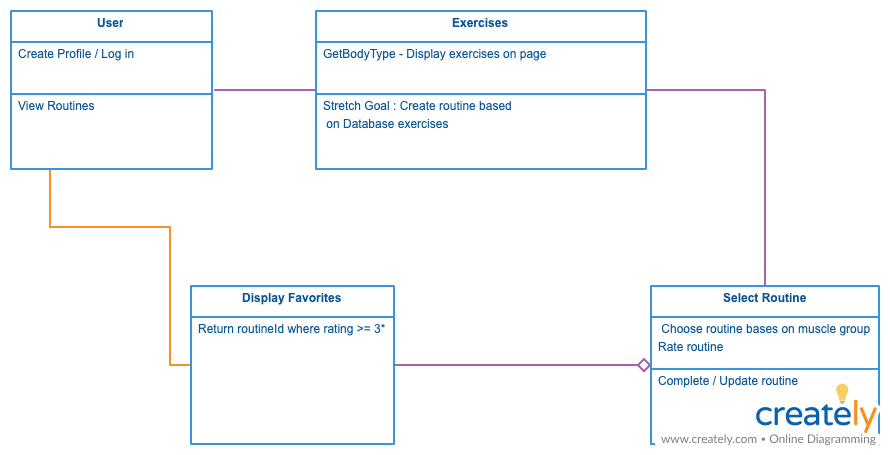
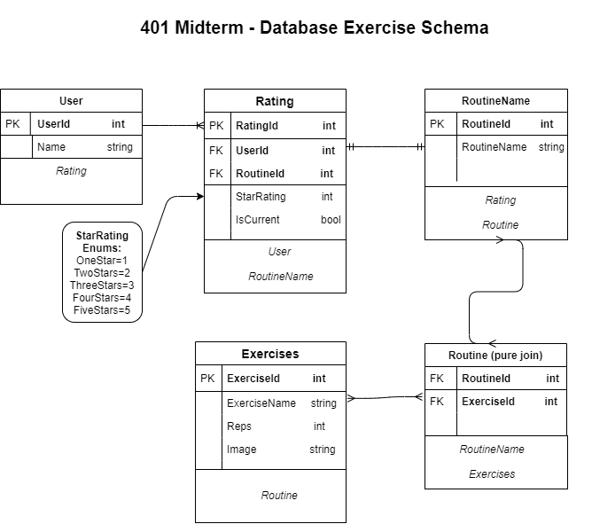

# Health At Home
Code Fellows 401 .NET - Midterm Project

## Web App
[Health At Home](https://healthathome.azurewebsites.net/) is an ASP.NET full stack web application developed with the health, fitness and sanity of our users in mind!

With Health At Home, users can create a basic profile, and browse a collection of fitness routines that can be completed at home with little to no equipment.

Users can also rate routines, and see a list of their favorite routines.

Stay healthy, stay happy, and get those gains without endangering yourself, your loved ones, or others!

## Tools Used
- C#
- ASP.NET
- MVC
- Azure App Services

## Getting Started

Clone this repository to your local machine.

```
$ git clone https://github.com/BuzzLightYearDotNet401/WebApp.git
```

Once downloaded, you can either use the dotnet CLI utilities or Visual Studio 2019 to build the web application. The solution file is located in the `HealthAtHome` subdirectory at the root of the repository.

```
$ cd HealthAtHome/HealthAtHome
$ dotnet build
```

The dotnet tools will automatically restore any NuGet dependencies. Before running the application, the provided code-first migration will need to be applied to the SQL server of your choice configured in the /HealthAtHome/HealthAtHome/appsettings.json file. This requires the Microsoft.EntityFrameworkCore.Tools NuGet package and can be run from the NuGet Package Manager Console:

```
$ Update-Database
```

Once the database has been created, the application can be run. Options for running and debugging the application using IIS Express or Kestrel are provided within Visual Studio. From the command line, the following will start an instance of the Kestrel server to host the application:

```
$ cd YourRepo/YourProject
$ dotnet run
```

## Visuals

## Data Flow

- When the user "logs in" to the app, a request is made to the Users table of the database and determines if that user exists.
- If the user exists, then the username is returned, and they are "logged in".
- If the user does not exist, then a user is created and inserted into the DB, and then they are "logged in".
- When the user views the list of routines, a request is made to the Routines table, and returns a list of all routines in the database. The data is then enumerated over and rendered on the routines View.
- When the user decides to view a specific routine, a request is made to the DB for the routine, which then returns the exercies associated with that routine and renders them on the specific routine View.
- When a user clicks to give a routine a rating, a form is submitted to the Ratings table that associates the rating given to the entry matched by the UserID and the RoutineID.
- When a user views the "Liked Routines" View, the DB is queried for all Routines that match the UserID and have a Rating of at least three stars.

##### Data Flow Image



## Data Model

#### Overall Project Schema
Our schema consists of 5 tables:
- User
- Rating
- Exercise
- Routing Name
- Routine

##### ERD



## Change Log

**0.4** - 20200415
- Image assets for exercises render correctly.
- Error messages render on user login and registration errors.
- User login and registration complete.

**0.3** - 20200414
- Added mappings for Dependency Injection within Controllers, Interfaces and Services.
- Rendered Index View as a partial within a Layout View.

**0.2** - 20200413
- Web app successfully makes calls to the API.

**0.1** - 20200413
- Dummy exercise data renders.
- Index View renders.
- Initial project / solution files created.

## Authors
Carrington Beard
- [GitHub](https://github.com/Carringtonb)
- [LinkedIn](https://www.linkedin.com/in/carrington-beard/)

Brandon Johnson
- [GitHub](https://github.com/SplinterCel3000)
- [LinkedIn](https://www.linkedin.com/in/brandon-johnson-33a581109/)

Robert Nielsen
- [GitHub](https://github.com/robertjnielsen)
- [LinkedIn](https://www.linkedin.com/in/robertjnielsen)

Allyson Reyes
- [GitHub](https://github.com/areyes986)
- [LinkedIn](https://www.linkedin.com/in/allyson-reyes/)

Sue Tarazi
- [GitHub](https://github.com/suetarazi)
- [LinkedIn](https://www.linkedin.com/in/sue-tarazi-b792b520)
